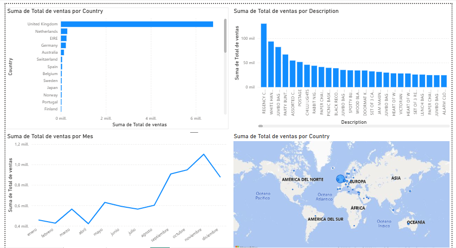
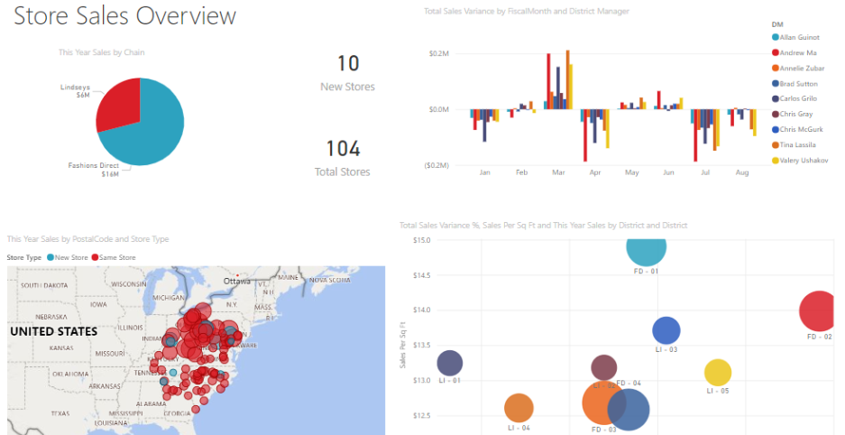

Database
This repository contains a simple SQL database project focused on data handling and analysis.

Data Analysis & Visualization
Although the dataset is small, this project demonstrates my ability to:

- Work with SQL queries and database structures  
- Clean and prepare data for analysis  
- Extract meaningful and reliable data  
- Export datasets for visualization  

I can provide analyses and graphs that show the results. This is another project I did in PowerPoint; however, I want to demonstrate that I can achieve these same graphs using usable and useful data from a database after processing it. 
Tools Used
- SQL  
- Data Cleaning  
- Data Analysis  
- Power BI  
